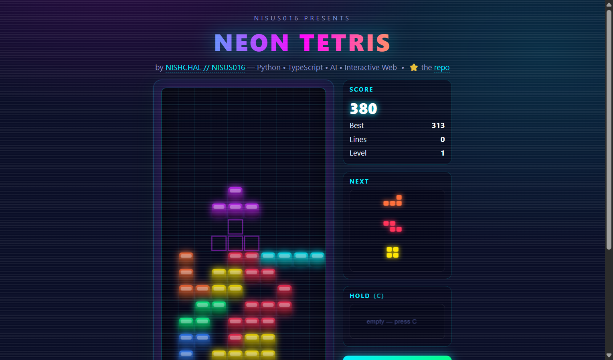

<p align="center">
  <a href="https://github.com/NISUS016/NISUS016"></a>
</p>

<p align="center">
  
  
  
</p>

---

## 🧠 About Me <sub><sup>`balanced mix: playful builder, serious skills`</sup></sub>

Hey, I'm **Nishchal (`NISUS016`)** — I turn notes, prompts, and weird ideas into **playable, interactive things on the web**. 🎮

- 🔬 **Right now:** building on **MIRAI-V1 / V2** + **Mirai-Edge** — prompt-driven AI assistants & edge tooling
- 🌍 **Hackathon mode:** built **ORBIT** (international hackathon project) — I like shipping MVPs fast, then remaking them better (`OPINION-METER` → `V1REMAKE` 😅)
- 🧩 **Simulations & systems:** **MARC-MAZE-SIM** — mazes, agents, behavior-driven models
- 📝 **Learn in public:** **general-notes** — my notes become interactive websites, not dusty docs
- ⚡ **Philosophy:** prototype fast → iterate in public → make it fun to use

```ts
const nisus016 = {
  languages: ["Python", "TypeScript", "JavaScript", "HTML", "SQL-ish chaos"],
  ai: ["prompt engineering", "LLM tools", "agentic workflows"],
  frontend: ["interactive UI", "canvas games", "notes → websites"],
  mindset: ["hackathon energy", "remake until great", "ship > perfect"],
  currentlyPlaying: "the Tetris below ⬇️ — beat my high score"
};
```

---

## 🛠️ Tech Stack

<p>
  
  
  
  
  
  
  
</p>

---

## 🔥 Featured Builds

| Project | What it is | Stack |
|---|---|---|
| [Mirai-Edge](https://github.com/NISUS016/Mirai-Edge) ⭐⭐⭐ | Edge-side MIRAI tooling | TypeScript |
| [MIRAI-V2](https://github.com/NISUS016/MIRAI-V2) | Next-gen prompt/AI assistant experiments | Python |
| [MIRAI-V1](https://github.com/NISUS016/MIRAI-V1) | Where the AI obsession started | Python |
| [OPINION-METER-V1REMAKE](https://github.com/NISUS016/OPINION-METER-V1REMAKE) | Interactive opinion app, remade better | TypeScript |
| [ORBIT](https://github.com/NISUS016/ORBIT) | International hackathon build | Python |
| [MARC-MAZE-SIM](https://github.com/NISUS016/MARC-MAZE-SIM) | Maze / simulation systems | Python |
| [NOTEKRAFT](https://github.com/NISUS016/NOTEKRAFT) + [general-notes](https://github.com/NISUS016/general-notes) | Notes → interactive websites | HTML |
| [PROMPTDEC](https://github.com/NISUS016/PROMPTDEC) | Prompt tooling / decoding ideas | TypeScript |

---

## 🎮 TETRIS ZONE — yes, it's really playable

<p align="center">
  <a href="https://nisus016.github.io/tetris-arcade/">
    
  </a>
</p>

<p align="center">
  <b>⬆️ Click PLAY — it opens the full neon arcade game in a new tab ⬆️</b><br/>
  <sub>Ghost piece • Hold • Next preview • Levels • Touch controls • High score saves in your browser</sub>
</p>

<p align="center">
  <a href="https://nisus016.github.io/tetris-arcade/"></a>
</p>

**Controls:** `← →` move · `↓` soft drop · `↑ / X` rotate · `Z` rotate back · `Space` hard drop · `C` hold · `P` pause · `R` restart · 📱 on-screen buttons on mobile

> Built with vanilla JS + Canvas, zero dependencies — the same stack I use for interactive web builds. Game lives at [`NISUS016/tetris-arcade`](https://github.com/NISUS016/tetris-arcade).

---

## 📊 Stats

<p align="center">
  
  
</p>
<p align="center">
  
  
</p>

---

<p align="center">
  <sub>Python • TypeScript • AI prompts • Interactive web — if it's playable, I probably built it. 👾</sub><br/>
  <a href="https://nisus016.github.io/tetris-arcade/">🕹️ play my tetris</a> •
  <a href="https://github.com/NISUS016/Mirai-Edge">edge ai</a> •
  <a href="https://github.com/NISUS016/ORBIT">hackathon</a>
</p>


