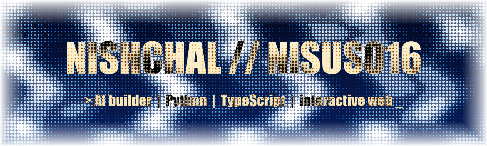
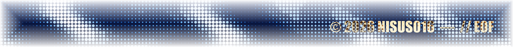

<p align="center">
  <a href="https://github.com/NISUS016/NISUS016"></a>
</p>

<p align="center">
  
  
  
</p>

## $ whoami

Hey, I'm **Nishchal (`NISUS016`)** — I turn notes, prompts, and weird ideas into **working, interactive software**.

- 🔬 **Right now:** building on **MIRAI-V1 / V2** + **Mirai-Edge** — prompt-driven AI assistants & edge tooling
- 🌍 **Hackathon mode:** built **ORBIT** (international hackathon project) — ship MVPs fast, then remake them better (`OPINION-METER` → `V1REMAKE`)
- 🧩 **Simulations & systems:** **MARC-MAZE-SIM** — mazes, agents, behavior-driven models
- 📝 **Learn in public:** **general-notes** — notes become interactive websites, not dusty docs
- 🎮 **Side quest:** a browser game, currently in the workshop
- ⚡ **Philosophy:** prototype fast → iterate in public → make it robust

```ts
const nisus016 = {
  languages: ["Python", "TypeScript", "JavaScript", "HTML"],
  ai: ["prompt engineering", "LLM tools", "agentic workflows"],
  frontend: ["interactive UI", "canvas", "notes → websites"],
  mindset: ["hackathon energy", "remake until great", "ship > perfect"],
  status: "building"
};
```

## 🛠️ Tech Stack

<p>
  
  
  
  
  
  
  
</p>

## 📦 Selected Work

| Project | What it is | Stack |
|---|---|---|
| [Mirai-Edge](https://github.com/NISUS016/Mirai-Edge) ⭐⭐⭐ | Edge-side MIRAI tooling | TypeScript |
| [MIRAI-V2](https://github.com/NISUS016/MIRAI-V2) | Next-gen prompt/AI assistant experiments | Python |
| [MIRAI-V1](https://github.com/NISUS016/MIRAI-V1) | Where the AI work started | Python |
| [OPINION-METER-V1REMAKE](https://github.com/NISUS016/OPINION-METER-V1REMAKE) | Interactive opinion app, remade better | TypeScript |
| [ORBIT](https://github.com/NISUS016/ORBIT) | International hackathon build | Python |
| [MARC-MAZE-SIM](https://github.com/NISUS016/MARC-MAZE-SIM) | Maze / simulation systems | Python |
| [NOTEKRAFT](https://github.com/NISUS016/NOTEKRAFT) + [general-notes](https://github.com/NISUS016/general-notes) | Notes → interactive websites | HTML |
| [PROMPTDEC](https://github.com/NISUS016/PROMPTDEC) | Prompt tooling / decoding ideas | TypeScript |

## 📊 Stats

<p align="center">
  
  
</p>
<p align="center">
  
</p>



<p align="center">
  <sub>Python • TypeScript • AI • Interactive web</sub><br/>
  <a href="https://github.com/NISUS016/Mirai-Edge">edge ai</a> •
  <a href="https://github.com/NISUS016/ORBIT">hackathon</a> •
  <a href="https://github.com/NISUS016/general-notes">notes</a>
</p>
